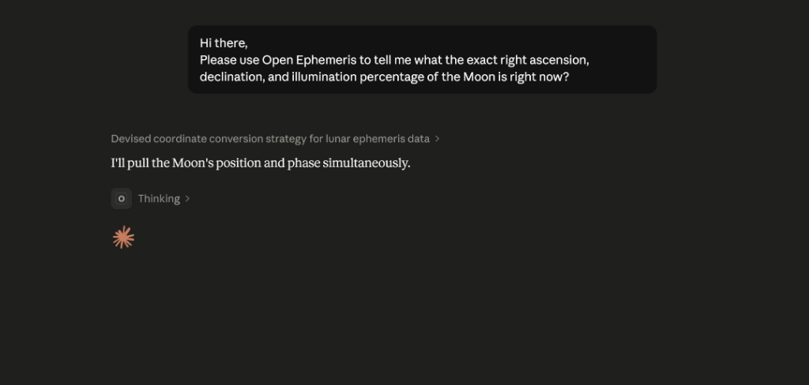
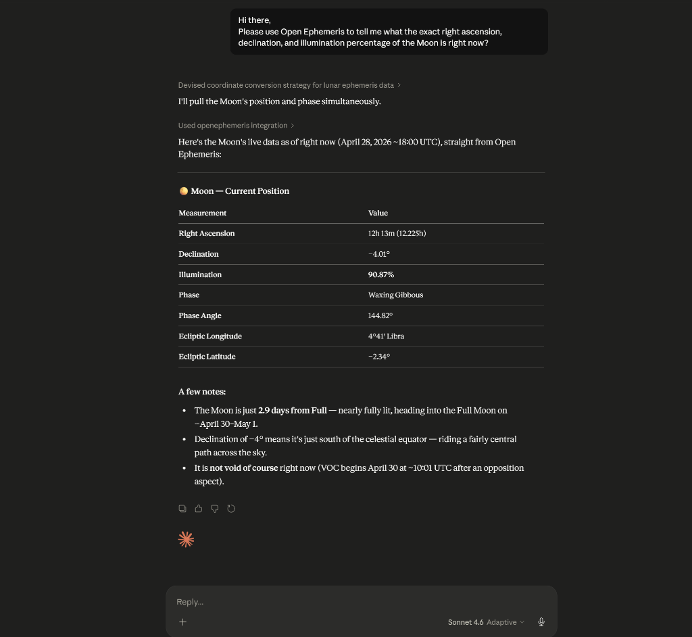

# OpenEphemeris MCP Server

[](https://smithery.ai/servers/open-ephemeris/openephemeris)
[](https://www.npmjs.com/package/@openephemeris/mcp-server)
[](https://status.openephemeris.com/)

**The deterministic math co-pilot for AI agents.** 52 typed astrology tools powered by the NASA JPL DE440 ephemeris — zero hallucination on planetary positions, dates, and degrees, spanning 1,100 years of astronomical data.

> **Hosted endpoint:** `https://mcp.openephemeris.com/mcp` (Streamable HTTP, MCP 2025-11-25 spec)

---

## 🛑 The Problem: LLMs Hallucinate Math

Standard LLMs (Claude, GPT-4, Gemini) are incredible at text, but they are inherently unreliable at spatial math, orbital mechanics, and temporal geometry. Ask an LLM to calculate a planetary transit, a natal chart, or an exact eclipse time, and it will confidently guess — hallucinating degrees, dates, and coordinates.

## 🟢 The Solution: Deterministic Ephemeris

By connecting the OpenEphemeris MCP to your AI agent, you offload the complex calculations to a deterministic, high-precision API powered by NASA JPL data. Your agent stops guessing and starts fetching millisecond-accurate placements.





*Claude calling the OpenEphemeris MCP tool in real-time to return exact lunar RA, declination, phase, and illumination — live from the NASA JPL ephemeris.*

---

## ⚡ Quick Start (Zero Installation)

Add one block to your AI client config to give your agent instant astronomical capabilities. No Python environment. No local install.

### Claude Desktop / Cursor / Windsurf

Add to your `claude_desktop_config.json` (or equivalent MCP config):

```json
{
  "mcpServers": {
    "openephemeris": {
      "command": "npx",
      "args": ["-y", "@openephemeris/mcp-server"],
      "env": {
        "OPENEPHEMERIS_PROFILE": "dev",
        "OPENEPHEMERIS_BACKEND_URL": "https://api.openephemeris.com",
        "OPENEPHEMERIS_API_KEY": "YOUR_API_KEY_HERE"
      }
    }
  }
}
```

Get your free API key at **[openephemeris.com/dashboard](https://openephemeris.com/dashboard)**.

**Config file locations:**

| Client | Config location |
|---|---|
| Claude Desktop (macOS) | `~/Library/Application Support/Claude/claude_desktop_config.json` |
| Claude Desktop (Windows) | `%APPDATA%\Claude\claude_desktop_config.json` |
| Cursor | `~/.cursor/mcp.json` |
| Windsurf | `~/.codeium/windsurf/mcp_config.json` |

### One-click install (Cursor)

<!-- GENERATED:CURSOR_INSTALL:BEGIN -->
[](cursor://anysphere.cursor-deeplink/mcp/install?name=openephemeris&config=eyJjb21tYW5kIjoibnB4IiwiYXJncyI6WyIteSIsIkBvcGVuZXBoZW1lcmlzL21jcC1zZXJ2ZXIiXSwiZW52Ijp7Ik9QRU5FUEhFTUVSSVNfUFJPRklMRSI6ImRldiIsIk9QRU5FUEhFTUVSSVNfQkFDS0VORF9VUkwiOiJodHRwczovL2FwaS5vcGVuZXBoZW1lcmlzLmNvbSIsIk9QRU5FUEhFTUVSSVNfQVBJX0tFWSI6IllPVVJfQVBJX0tFWV9IRVJFIn19)

> Replace `YOUR_API_KEY_HERE` in Cursor MCP settings with your API key from https://openephemeris.com/dashboard.

Cursor deeplink payload:
```json
{
  "command": "npx",
  "args": [
    "-y",
    "@openephemeris/mcp-server"
  ],
  "env": {
    "OPENEPHEMERIS_PROFILE": "dev",
    "OPENEPHEMERIS_BACKEND_URL": "https://api.openephemeris.com",
    "OPENEPHEMERIS_API_KEY": "YOUR_API_KEY_HERE"
  }
}
```
<!-- GENERATED:CURSOR_INSTALL:END -->

### Install via Smithery

```bash
npx -y @smithery/cli install @open-ephemeris/openephemeris --client claude
```

Or browse the listing and copy connection snippets: **[smithery.ai/servers/open-ephemeris/openephemeris](https://smithery.ai/servers/open-ephemeris/openephemeris)**

### Remote clients (Claude Web, ChatGPT, etc.)

The server is hosted at `https://mcp.openephemeris.com/mcp` with full Streamable HTTP support. Remote-only clients can connect directly — no bridge or proxy required:

- **Claude Web**: Add `https://mcp.openephemeris.com/mcp` as a remote MCP server with `X-API-Key: your-key` header
- **Via Smithery**: Use the [Smithery listing](https://smithery.ai/servers/open-ephemeris/openephemeris) for managed connections
- **Legacy SSE**: `https://mcp.openephemeris.com/sse` remains available for SSE-only clients

> **Detailed setup walkthroughs** for each platform are in [SETUP.md](./SETUP.md).

---

## 🪄 Magic Prompts — Test Your Agent Instantly

Once installed, paste any of these directly into Claude, Cursor, or Windsurf to see the MCP in action:

**🌙 Basic Data Test**
> *"What is the exact right ascension, declination, and illumination percentage of the Moon right now?"*

**🪐 Complex Analysis Test**
> *"Calculate the exact planetary placements for someone born in New York City on May 15, 1990 at 8:00 AM UTC. Format the output as a neat JSON object."*

**🗺️ Astrocartography Test**
> *"Show me my Venus and Jupiter astrocartography lines. Which cities in Europe are within 3° of my Venus line?"*

**⚡ Electional Test**
> *"Find the best window in the next 30 days to sign a contract — no void-of-course Moon, no Mercury retrograde, ideally with Jupiter well-placed."*

**🚀 App Generation Test**
> *"Fetch today's moon phase and illumination percentage. Then write a single-file React component using Tailwind CSS that displays this data in a beautiful dark-mode card."*

---

## What You Can Ask

```
"Calculate a natal chart for 1990-04-15 at 2:30 PM in Chicago."
"Find all Saturn transits to my natal Sun in the next 6 months."
"Get the current moon phase and void-of-course status."
"Find the next solar eclipse visible from Tokyo."
"Find the best time to sign a contract in March — electional window."
"Generate a Human Design chart for my birth data."
"What is my Vedic (sidereal) chart?"
"Calculate my Chinese BaZi (Four Pillars) chart."
"Show me my Astrocartography power lines — where is my Venus line on the map?"
"Find all ACG lines within 3° of Paris for my chart."
"Calculate a synastry chart between two people."
"Find the next Venus Star Point and my relationship to it."
"What are the active planetary stations in the next 3 months?"
"Calculate primary directions for the next 5 years."
"Find my Firdaria time lord period."
"What is the sidereal time and delta-T right now?"
```

---

## 🏗️ Coming Soon: The Example Gallery

We are building a suite of open-source apps demonstrating what AI agents can create with this MCP in under 60 seconds.

- [ ] 🌑 **Zero-to-Live Moon Phase Tracker** (React + Tailwind)
- [ ] ✨ **AI Astrologer / Natal Chart Generator** (Next.js + SVG)
- [ ] 🪐 **Astrocartography Explorer** (Leaflet + MapLibre)
- [ ] 📐 **Command-Line Ephemeris Calculator** (Python)

**⭐ [Star this repo](https://github.com/openephemeris/openephemeris-MCP) to get notified when the source code drops.**

---

## Tools at a Glance

| Category | Tool | Tier |
|---|---|---|
| Natal chart | `ephemeris_natal_chart` | Explorer |
| Transit forecast | `ephemeris_transits` | Explorer |
| Transit chart snapshot | `ephemeris_natal_transits` | Explorer |
| Moon phase / VOC | `ephemeris_moon_phase` | Explorer |
| Eclipse next visible | `ephemeris_next_eclipse` | Explorer |
| Electional window | `ephemeris_electional` | Developer |
| Moment analysis | `electional_moment_analysis` | Developer |
| Station tracker | `electional_station_tracker` | Developer |
| Aspect search | `electional_aspect_search` | Developer |
| Human Design chart | `human_design_chart` | Explorer |
| HD composite | `human_design_composite` | Explorer |
| HD penta | `human_design_penta` | Explorer |
| HD return / opposition | `hd_planetary_return`, `hd_opposition` | Explorer |
| Vedic chart | `vedic_chart` | Explorer |
| BaZi (Chinese) | `chinese_bazi` | Explorer |
| Synastry | `ephemeris_synastry` | Developer |
| Composite chart | `ephemeris_composite` | Developer |
| Relocation chart | `ephemeris_relocation` | Developer |
| Progressed chart | `ephemeris_progressed_chart` | Explorer |
| Solar return | `ephemeris_solar_return` | Developer |
| Lunar return | `ephemeris_lunar_return` | Developer |
| Planetary return | `ephemeris_planetary_return` | Developer |
| Astrocartography lines | `acg_power_lines` | Developer |
| ACG hits at location | `acg_hits` | Scale |
| Venus Star Points | `venus_star_points` + 4 more | Explorer |
| Chart wheel image | `ephemeris_chart_wheel` | Developer |
| Bi-wheel image | `ephemeris_bi_wheel` | Developer |
| Dignities / Midpoints / Fixed stars | `ephemeris_dignities`, `ephemeris_midpoints`, `ephemeris_fixed_stars` | Explorer |

---

## Connect via Code

### Vercel AI SDK

```typescript
import Smithery from "@smithery/api"
import { createMCPClient } from "@ai-sdk/mcp"
import { generateText } from "ai"
import { anthropic } from "@ai-sdk/anthropic"
import { createConnection } from "@smithery/api/mcp"

const smithery = new Smithery()

const conn = await smithery.connections.create("{your-namespace}", {
  mcpUrl: "https://server.smithery.ai/open-ephemeris/openephemeris",
  headers: {
    apiKey: "your-openephemeris-api-key", // get one free at openephemeris.com/dashboard
  },
})

const { transport } = await createConnection({
  client: smithery,
  namespace: "{your-namespace}",
  connectionId: conn.connectionId,
})

const mcpClient = await createMCPClient({ transport })
const tools = await mcpClient.tools()

const { text } = await generateText({
  model: anthropic("claude-sonnet-4-20250514"),
  tools,
  prompt: "Calculate a natal chart for someone born April 15, 1990 at 2:30 PM in Chicago.",
})

await mcpClient.close()
```

### MCP SDK (TypeScript)

```typescript
import Smithery from "@smithery/api"
import { Client } from "@modelcontextprotocol/sdk/client/index.js"
import { createConnection } from "@smithery/api/mcp"

const smithery = new Smithery()

const conn = await smithery.connections.create("{your-namespace}", {
  mcpUrl: "https://server.smithery.ai/open-ephemeris/openephemeris",
  headers: {
    apiKey: "your-openephemeris-api-key",
  },
})

const { transport } = await createConnection({
  client: smithery,
  namespace: "{your-namespace}",
  connectionId: conn.connectionId,
})

const mcpClient = new Client(
  { name: "my-app", version: "1.0.0" },
  { capabilities: {} }
)
await mcpClient.connect(transport)

const { tools } = await mcpClient.listTools()
const result = await mcpClient.callTool({
  name: "ephemeris_natal_chart",
  arguments: { datetime: "1990-04-15T14:30:00", latitude: 41.8781, longitude: -87.6298, format: "llm" },
})
```

### Streamable HTTP (direct, no Smithery)

```typescript
import { StreamableHTTPClientTransport } from "@modelcontextprotocol/sdk/client/streamableHttp.js"
import { Client } from "@modelcontextprotocol/sdk/client/index.js"

const transport = new StreamableHTTPClientTransport(
  new URL("https://mcp.openephemeris.com/mcp"),
  { requestInit: { headers: { "X-API-Key": "your-openephemeris-api-key" } } }
)

const client = new Client({ name: "my-app", version: "1.0.0" }, { capabilities: {} })
await client.connect(transport)
```

---

## Auth and Error Behavior

| Status | Behavior |
|---|---|
| `401` Missing/invalid key | Tool call returns signup/sign-in link → `openephemeris.com/login` |
| `403` Tier-gated endpoint | Tool call returns upgrade link → `openephemeris.com/pay` |
| `402` Quota exhausted | Tool call returns usage guidance and upgrade link |
| `429` Rate limited | Tool call returns retry guidance and dashboard link |

---

## Tooling Model

- Typed tools are preferred for common workflows (natal, transits, moon phase, eclipse, synastry, relocation, electional, Human Design).
- Generic tools: `dev.list_allowed` returns all currently allowlisted operations, and `dev.call` invokes any allowlisted operation by `method + path`.
- Security model: default-deny with explicit allowlist in `config/dev-allowlist.json`.
- Deny prefixes block sensitive route families (`/auth`, `/billing`, `/admin`, etc.).

### `dev.call` input

| Parameter | Type | Required | Description |
|---|---|---|---|
| `method` | `GET\|POST\|PUT\|PATCH\|DELETE` | Yes | HTTP method |
| `path` | `string` | Yes | Absolute API path, e.g. `/ephemeris/natal-chart` |
| `query` | `object` | No | Query parameters |
| `body` | `object` | No | JSON body for non-GET requests |
| `preset` | `full\|simple` | No | Convenience mapping to `query.preset` |
| `format` | `json\|llm\|llm_v2` | No | Convenience mapping to `query.format` (`llm_v2` normalizes to `llm`) |
| `output_mode` | `full\|simple\|llm\|llm_v2` | No | Legacy compatibility field |

---

## Environment Variables

| Variable | Required | Description |
|---|---|---|
| `OPENEPHEMERIS_API_KEY` | Yes (unless service key/JWT used) | API key for OpenEphemeris |
| `ASTROMCP_API_KEY` | No | Legacy alias for `OPENEPHEMERIS_API_KEY` (checked as fallback) |
| `OPENEPHEMERIS_BACKEND_URL` | No | Defaults to `https://api.openephemeris.com` |
| `OPENEPHEMERIS_PROFILE` | No | `dev` by default |
| `OPENEPHEMERIS_SERVICE_KEY` | No | Internal service auth |
| `OPENEPHEMERIS_JWT` | No | Bearer token auth |
| `OPENEPHEMERIS_DEV_ALLOWLIST_PATH` | No | Override allowlist file path |
| `MCP_USER_ID` | No | Per-instance user identifier |

Legacy aliases (`ASTROMCP_*`, `MERIDIAN_*`) remain supported.

---

## Architecture

```text
┌─────────────────────────────────────────────────────────┐
│                    MCP Clients                          │
│  Smithery Gateway · Claude Web · ChatGPT · Remote apps  │
└──────────────────┬──────────────────────────────────────┘
                   │ Streamable HTTP (MCP 2025-11-25)
                   │ https://mcp.openephemeris.com/mcp
                   │
┌─────────────────────────────────────────────────────────┐
│          Cursor · Claude Desktop · Windsurf             │
└──────────────────┬──────────────────────────────────────┘
                   │ stdio JSON-RPC
                   │ npx @openephemeris/mcp-server
                   │
              ┌────▼────────────────────┐
              │  openephemeris-mcp      │
              │  Node.js MCP Server     │
              │  52 typed tools         │
              │  auth: Key > JWT        │
              └────────────┬────────────┘
                           │ HTTPS
                           ▼
              ┌────────────────────────┐
              │  OpenEphemeris API     │
              │  api.openephemeris.com │
              │  NASA JPL DE440        │
              │  1,100 years of data   │
              └────────────────────────┘
```

---

## Why OpenEphemeris for AI Agents?

Most LLMs (like Claude and ChatGPT) struggle heavily with astronomical calculations (trigonometry, Julian date conversions, and planetary lookups). OpenEphemeris serves as a **secure, remote math engine**.

By pairing LLMs with the OpenEphemeris MCP server, your agents can instantly access:
- **Zero-hallucination coordinates**: Direct, sub-arcsecond NASA JPL DE440 calculations spanning 1,100 years of astronomical data.
- **LLM-optimized tokens (`format=llm`)**: We compress standard 25,000 token JSON chart responses into minimal text blocks, cutting your inference costs by 50%.
- **Ready-to-use astrology layers**: Built-in support for Astrocartography geoJSON lines, Hermetic Lots, Fixed Stars, and complex Human Design matrix generation.

---

## Legal

This package is licensed under the [MIT License](./LICENSE). However, use of this package to access the OpenEphemeris API constitutes use of the Service and is governed by the [OpenEphemeris Terms of Service](https://openephemeris.com/terms). By using this package, you agree to those terms. See also the [Privacy Policy](https://openephemeris.com/privacy) and [Acceptable Use Policy](https://openephemeris.com/acceptable-use).